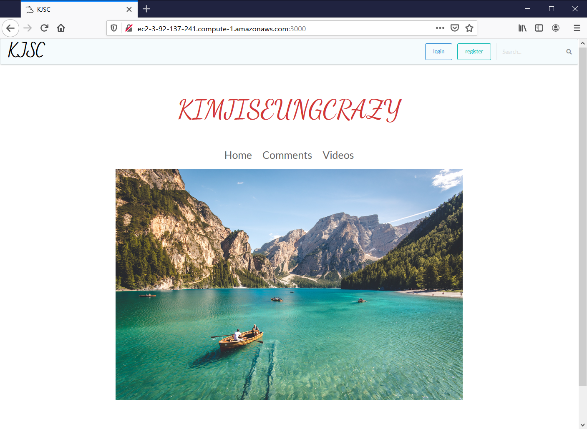
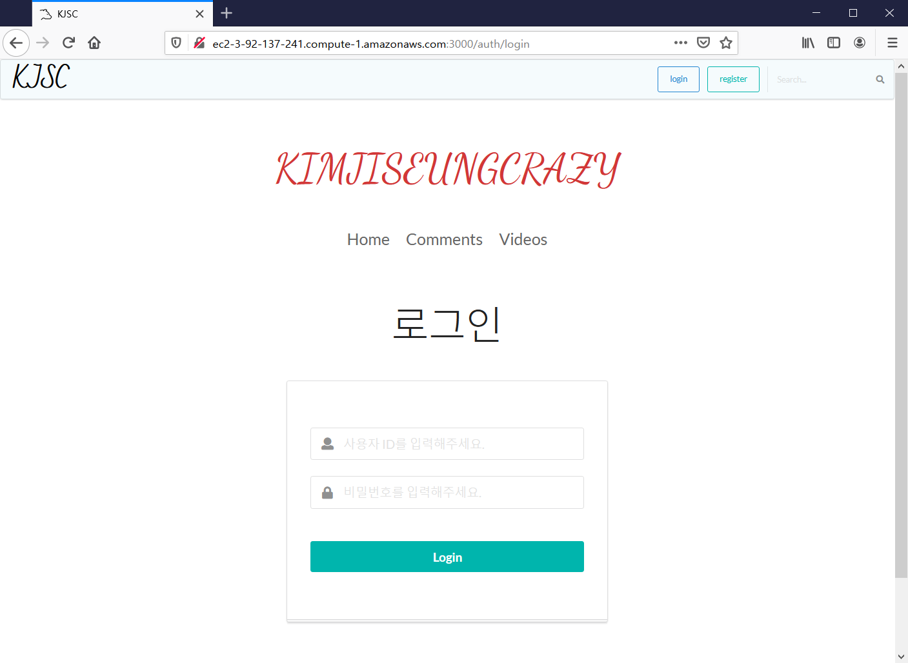
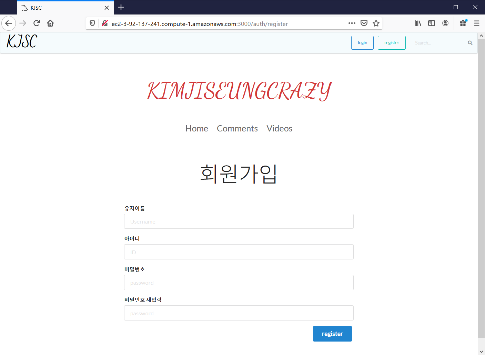
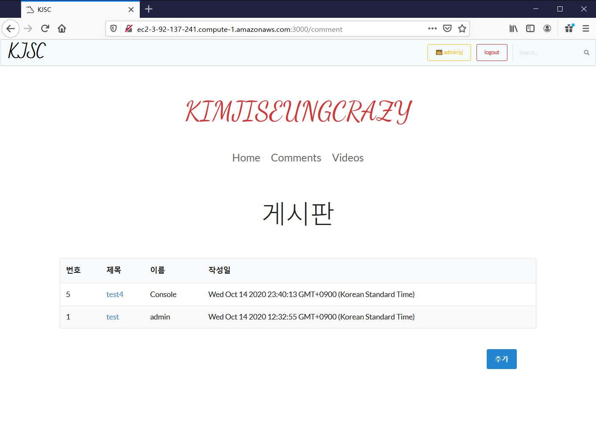
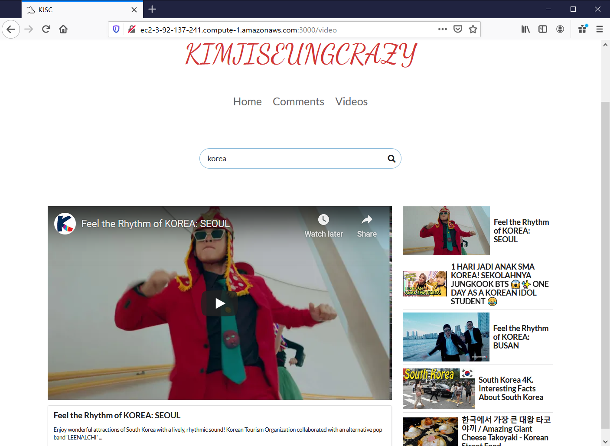

# KJSC2 
친척동생을 위해서 만든 웹 어플리케이션입니다.   
KJSC2 앱은 Home, Comments, Videos의 3가지 페이지가 있으며 로그인을 하지 않았을 경우, 오직 Home 페이지만 접근할 수 있습니다.     
(로그인을 하지 않았을 경우, Comments나 Videos 버튼을 클릭하면 Home 페이지로 리다이렉트됩니다.)     
Home 페이지는 매번 로드할 때마다 중앙에 있는 사진이 랜덤하게 선택되어 렌더링됩니다.     
Comments 페이지는 게시판 페이지로, 유저들이 '추가' 버튼을 눌러 게시판을 작성할 수 있습니다. 일반 게시판과 마찬가지로 유저가 다른 유저의 게시물을 수정하거나 삭제할 수 없으며 오직 자기 자신의 게시물만 수정하거나 삭제할 수 있습니다.      
Videos 페이지에서는 검색창을 이용하여 Youtube 비디오들을 찾고 찾은 비디오들을 볼 수 있도록 개발하였습니다.     
완성된 어플리케이션은 AWS educate 사이트의 ec2를 이용해서 배포하였습니다.     
(KJSC2 사이트 : http://ec2-3-92-137-241.compute-1.amazonaws.com:3000/)       
 
# Demo Web Site 
### Home page 
      

### Login page
      

### Register page
      

### Comment page
        

### Video page
         

# How to use    
```
// 깃 허브에서 소스코드를 다운로드 받습니다.
git clone https://github.com/Brylimo/KJSC2.git

// 받은 프로젝트 폴더로 이동합니다.
cd KJSC2

// example.sql 파일을 이용해서 'kjsc' mysql database를 생성하고 mysql.json 파일을 생성합니다.
vi mysql.json

// node_modules 폴더를 다운로드받습니다.
npm install

// 웹 서버를 실행합니다.
npm start
```
